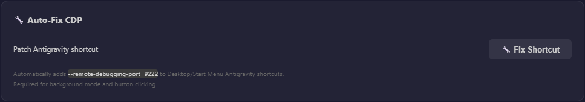
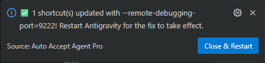

# ⚡ Auto Accept Agent Pro

> Automatically accept file edits, terminal commands, and agent prompts in **Antigravity**, **Cursor**, **Windsurf**, **Trae**, and **VS Code** IDEs. Premium protection, live configuration, and full analytics.

<p>
  <a href="https://www.buymeacoffee.com/lynkv" target="_blank"></a>
  &nbsp;&nbsp;
  <a href="https://buymeacoffee.com/lynkv" target="_blank"></a>
</p>

---

## 🚀 Quick Start

1. **Install the extension** (`.vsix` file or from marketplace)
2. Look for **`Accept OFF`** in the status bar (bottom-right)
3. **Click to enable** → it starts auto-accepting immediately
4. Press `$(gear)` to open the Settings dashboard

### Background Mode
1. Enable Auto Accept first
2. Click **`BG Mode: OFF`** in the status bar
3. Follow the **CDP setup** if prompted (one-time)
4. The overlay will show progress for all tabs

### Keyboard Shortcuts

| Shortcut | Action |
|----------|--------|
| `Ctrl+Shift+A` | Toggle Auto Accept ON/OFF |
| `Alt+Shift+A` | Toggle Background Mode |

---

## ✨ Features

### 🎯 Auto Click — Configurable Patterns
Automatically clicks **Accept**, **Run**, **Allow**, **Continue**, **Retry**, and more — fully configurable from the Settings panel.

**Default patterns:** `Run`, `Allow`, `Always Allow`, `Keep Waiting`, `Retry`, `Continue`, `Allow Once`, `Allow This Con`, `Accept all`

### 🔄 Background Mode — Multi-Tab Cycling
Accepts across **all open conversations** by connecting via Chrome DevTools Protocol (CDP). Cycles through tabs, detects completion badges, and shows a visual progress overlay.

### 📜 Auto Scroll
Automatically scrolls the **agent chat panel** to the bottom so you never miss new content.
- **Chat-panel-only** — uses smart heuristic to find the deepest scrollable container inside the agent panel
- **Manual scroll detection** — pauses scrolling when you scroll up manually
- **Configurable timing** — Pause duration (1–20s) and scroll interval (200–2000ms)
- **Editor-safe** — never scrolls terminal, output, or file explorer panels

### 🔒 Safe Click
Only clicks buttons that have a sibling **Reject** / **Deny** / **Cancel** button nearby — prevents accidental clicks on non-confirmation buttons.
- Checks **3 DOM levels**: parent → grandparent → great-grandparent
- Toggleable ON/OFF from Settings

### 🛡️ Diff Protection
Prevents clicking **"Accept Changes"**, **"Accept All"**, **"Accept Incoming"**, etc. inside diff and merge editors.
- **Two-layer check:**
  1. Text-matching against known editor button labels
  2. DOM container detection (`.monaco-diff-editor`, `.merge-editor-view`)
- Toggleable ON/OFF from Settings

### 🔥 God Mode
Auto-accepts **"Always Allow"**, **"Always Run"**, **"Allow This Conversation"** buttons.
- **OFF** (default): These buttons are on the reject list for safety
- **ON**: Removes them from reject list — full autonomous access
- Toggle from Settings panel or command palette
- State syncs via HTTP to injection scripts in real-time

### 🔧 Auto-Fix CDP Shortcut
One-click fix for Windows CDP setup:
- Scans Desktop + Start Menu for IDE shortcuts (Antigravity, Cursor, Windsurf, Trae)
- Adds `--remote-debugging-port=9222` to shortcut target
- Auto-corrects wrong port if set to different value
- Shows clear feedback: **PATCHED** / **ALREADY_OK** / **NOT_FOUND**

**Settings → Auto-Fix CDP:**



**After clicking Fix Shortcut:**



> ⚠️ **Important:** Mỗi lần IDE cập nhật phiên bản mới, shortcut sẽ bị ghi đè và mất flag `--remote-debugging-port=9222`. Hãy vào **Settings → Auto-Fix CDP → Fix Shortcut** để patch lại sau mỗi lần update IDE. Nếu không, Background Mode và Auto Click sẽ không hoạt động.

### 🧠 Smart Accept — Command Safety
Blocks dangerous terminal commands before they execute:
- **Block list:** `rm -rf`, `format c:`, `del /f /s /q`, `dd if=`, etc.
- **Smart rules:** Pattern-based rules with configurable actions (block, warn, allow)
- **Regex support:** Use `/pattern/i` syntax in banned commands

### 📡 HTTP Live Sync
All settings changes are pushed to the injected script **in real-time** via HTTP. No restart required when toggling features or changing patterns.

### ⏰ Auto-Schedule
Automatically enable/disable the extension by time of day.
- Supports **cross-midnight** ranges (e.g., 23:00 → 07:00)

### 🔄 Smart Frequency
Dynamically adjusts poll speed based on agent activity:

| Tier | Interval | When |
|------|----------|------|
| ⚡ FAST | 500ms | Agent actively generating |
| 🟢 NORMAL | 1,000ms | Recent activity |
| 🟡 SLOW | 2,000ms | Idle for a while |
| 🔴 IDLE | 3,000ms | No activity detected |

### 📊 ROI Dashboard
Track productivity gains with detailed analytics:
- **This Week / Lifetime** stats with animated counters
- **Session History** — Live feed with ✅ accepts, 🚫 blocks, ⚠️ warnings
- **Weekly Notifications** — Automatic summary each week
- **Config Export/Import** — JSON backup of all settings

### 📊 Status Bar (3 Items)

| Item | Function |
|------|----------|
| `$(check) Auto Accept` | Toggle auto-accept (tooltip shows scroll state) |
| `BG Mode ON/OFF` | Toggle background mode |
| `$(gear)` | Open Settings panel |

---

## 🛠️ Requirements

- **Antigravity IDE** (primary), **Cursor IDE**, **Windsurf IDE**, **Trae IDE**, or **VS Code**
- For **Background Mode + Auto Scroll**: Chrome DevTools Protocol enabled with `--remote-debugging-port=9222` (the extension will guide you through setup)

---

## 📋 All Commands

| Command | Description |
|---------|-------------|
| `Auto Accept: Toggle ON/OFF` | Enable/disable auto-accepting |
| `Auto Accept: Toggle Background Mode` | Enable multi-tab mode |
| `Auto Accept: Toggle Auto Scroll` | Enable/disable auto-scroll |
| `Auto Accept: Toggle Safe Click` | Enable/disable sibling-reject check |
| `Auto Accept: Toggle Diff Protection` | Enable/disable diff editor protection |
| `Auto Accept: Toggle Smart Accept` | Enable/disable command safety |
| `Auto Accept: Toggle Smart Frequency` | Enable/disable adaptive polling |
| `Auto Accept: Open Settings` | Open the full dashboard |
| `Auto Accept: Toggle God Mode` | Toggle God Mode ON/OFF |
| `Auto Accept: Auto-Fix CDP` | Fix CDP shortcut on Windows |
| `Auto Accept: Update Frequency` | Set poll frequency (200–3000ms) |
| `Auto Accept: Update Banned Commands` | Edit blocked command patterns |
| `Auto Accept: Update Click Patterns` | Configure which buttons to auto-click |
| `Auto Accept: Update Scroll Config` | Set scroll pause/interval timing |
| `Auto Accept: Update Schedule` | Set auto-schedule times |
| `Auto Accept: Update Smart Rules` | Edit smart accept rules |
| `Auto Accept: Get ROI Stats` | Retrieve productivity statistics |
| `Auto Accept: Get Session History` | View recent accept/block history |
| `Auto Accept: Clear Session History` | Reset the session log |

---

## ⚙️ Settings Panel

Open via the `$(gear)` status bar icon or `Auto Accept: Open Settings` command.

All features are configurable from the dashboard — no manual JSON editing required.

---

## 🔧 Architecture

```
Extension Host                    CDP (port 9222)
┌─────────────────┐              ┌─────────────────┐
│  extension.js   │──── CDP ────▶│  Injected Script │
│  ┌────────────┐ │              │  (compositor.js)  │
│  │ HTTP :48787│◀─── Poll 2s ──│                   │
│  └────────────┘ │              │  • Auto Click     │
│  • State Mgmt   │              │  • Safe Click     │
│  • Status Bar   │              │  • Diff Protection│
│  • Commands     │   Fresh WS   │  • Auto Scroll    │
│  • ROI Stats    │──── 1.5s ───▶│  • HTTP Polling   │
│  • Scheduling   │  Permission  │  • Stats Tracking │
│  • God Mode     │   Script     │  • Webview Guard  │
└─────────────────┘              └─────────────────┘
```

**Dual CDP Strategy:**
1. **Persistent Injection** — `compositor.js` / `background_mode.js` injected once, runs continuous poll loop
2. **Permission Script Cycle** — Fresh `buildPermissionScript()` evaluated every 1.5s on ALL pages via new WebSocket (MarcoDeliaBot-style), with Webview Guard + `textMatches()` + Shadow DOM TreeWalker

---

## 📝 Changelog

### v1.5.4
- 🔧 **Fix Shortcut improved** — 3 outcomes (PATCHED/ALREADY_OK/NOT_FOUND), multi-IDE, wrong port fix
- 📋 **Copy Flag button** — khi không tìm thấy shortcut
- ⚠️ **Readme warning** — nhắc chạy lại Fix Shortcut sau mỗi lần IDE update

### v1.5.2
- 🐛 **Background fix** — Web Worker timer bypasses browser throttling when window loses focus
- 🐛 **requestAnimationFrame removed** — replaced with setTimeout (rAF stops when unfocused)
- 🐛 **Loop delays** — all delays use workerDelay() via Web Worker thread

### v1.5.1
- 🔥 **Run button fix** — CDP permission script cycle with Webview Guard + textMatches
- 🔍 **Webview context** — detects `vscode-webview://` and skips sidebar exclusion
- 📜 **Auto Scroll fix** — works in OOPIF webview with document.body fallback
- 🌐 **17-port scan** — CDP permission scans 9222, 9229, 9000–9014

### v1.5.0
- 📊 **Status bar cleanup** — 4 items → 3 (removed Auto Scroll button)
- ⌨️ **Removed Ctrl+Shift+S** — scroll managed via Settings panel

### v1.4.9
- 🔥 **God Mode** — auto-accept "Always Allow" / "Always Run" buttons
- 🔧 **Auto-Fix CDP** — one-click Windows shortcut patching
- 🔒 **Async lock** — prevents double-accepts
- 🕳️ **Shadow DOM piercing** — queryAll traverses shadowRoot

### v1.4.8
- 🔗 **MunKhin integration** — banned command detection near Run buttons
- 📡 **bannedCommands sync** — HTTP server sends to injection scripts

### v1.4.7
- 🐛 **Docker error fix** — removed `run`/`execute` commands from polling
- 🐛 **Chat-only scroll** — smart heuristic targets agent panel only
- 🐛 **CDP port unified** — all files now use port 9222
- 🐛 **HTTP port fix** — injected scripts use actual bound port
- ⚡ **Icon optimized** — 2.4 MB → 103 KB

---

## ☕ Support

If this extension saves you time, consider buying me a coffee!

<p>
  <a href="https://www.buymeacoffee.com/lynkv" target="_blank"></a>
  &nbsp;&nbsp;
  <a href="https://buymeacoffee.com/lynkv" target="_blank"></a>
</p>

---

## 📄 License

MIT License — Free and open source.
